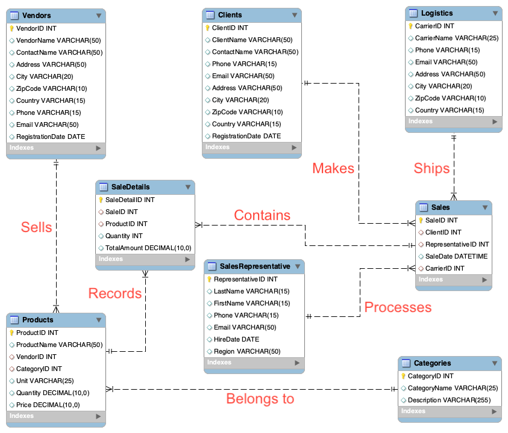

# Wholesale Store Database

## Executive Summary

Wholesale Store is a leading wholesale distribution company that specializes in providing a wide range of
products to various retail businesses across multiple sectors, including food and beverage, electronics,
and household goods. The company has established a vast network of vendors and logistics partners,
enabling efficient and reliable distribution services across the region.

The cornerstone of Wholesale Store's success lies in its customer-centric approach, focusing on
understanding the unique needs of each retail client and offering tailored solutions to meet those needs.
This approach includes implementing strategic promotional campaigns and offering various payment
options to cater to diverse client preferences. Wholesale Store's promotional strategies involve offering
discounts, special deals, and targeted marketing campaigns to drive sales and foster customer loyalty.
Additionally, the company provides a range of payment methods, including credit cards, online payment
platforms, and bank transfers, to ensure a seamless and convenient transaction experience for its clients.

Wholesale Store's team of dedicated sales representatives plays a crucial role in building long-lasting
relationships with clients, characterized by trust, reliability, and mutual growth. The company leverages
its comprehensive database solution to streamline inventory management, order processing, vendor and
client management, sales and logistics coordination, and financial tracking. This database system
incorporates modules for managing promotions, tracking discounts applied to products and sales, and
maintaining records of payment methods used for transactions.

As Wholesale Store looks to the future, it aims to expand its footprint, exploring new markets and
embracing innovative technologies to enhance its operational efficiencies and customer service further.
The company is dedicated to remaining at the forefront of the wholesale distribution industry,
continuously adapting to the changing retail landscape and the evolving needs of its clients while
leveraging its robust database solution and strategic promotional and payment capabilities.

---

## Problem Statement

As Wholesale Store continues to expand its operations and client base, it faces increasingly complex
challenges that threaten its efficiency, customer satisfaction, and scalability. The company's existing
manual and semi-automated systems are proving inadequate to handle the growing complexity and
volume of transactions, leading to several critical operational issues:

- **Inventory Management Inefficiency**: Difficulty in tracking and managing stock levels in real-time, leading
  to overstocking or stockouts.
- **Order Processing Delays**: Slow manual processes for order entry, processing, and fulfillment.
- **Vendor and Client Management Limitations**: Inefficiencies in managing extensive vendor and client
  databases with varying needs and specifications.
- **Sales and Logistics Coordination**: Challenges in coordinating between sales teams and logistics partners,
  affecting delivery timelines.
- **Data Accessibility and Reporting**: Limited ability to access real-time data and generate insightful reports
  for strategic decision-making.
- **Scalability Concerns**: Existing systems are not equipped to scale with the business, limiting potential
  growth.
- **Promotion Management Shortcomings**: Lack of an integrated system to manage and track the impact of
  promotional campaigns on sales and inventory.
- **Payment Processing Inefficiencies**: Restricted payment options and slow processing times that affect
  customer experience and operational fluidity.

While Wholesale Store has implemented various promotional strategies to drive sales and foster customer
loyalty, managing these campaigns manually or through disparate systems has become increasingly
challenging. The lack of a centralized system for tracking promotions, applying discounts, and analyzing
the effectiveness of campaigns hinders the company's ability to optimize its marketing efforts and
maximize revenue potential.

Furthermore, the current systems in place offer limited payment options for clients, potentially restricting
sales and hindering customer satisfaction. Comprehensive financial tracking and reconciliation processes
are also hindered due to the lack of integration between payment methods and sales records.

To address these challenges, "Wholesale Store" requires a comprehensive database solution that
streamlines inventory management, order processing, vendor and client management, sales and logistics
coordination, and financial tracking. Additionally, the database system must incorporate modules for
managing promotions, tracking discounts applied to products and sales, and maintaining records of
payment methods used for transactions. Implementing such a database system is essential for enhancing
operational efficiencies, improving customer service, optimizing marketing efforts, and ensuring
"Wholesale Store" remains competitive in the wholesale distribution industry.

---

## Entities

We have identified the following entities:

- **Categories**: Classifies products into various categories.
- **Clients**: Records details of retail businesses purchasing from "Wholesale Store."
- **Sales Representative**: Information about employees responsible for managing client accounts.
- **Logistics**: Details of shipping and logistics partners used for order delivery.
- **Vendors**: Information on suppliers from whom products are sourced.
- **Products**: The catalog of items available for sale, including vendor and category details.
- **Sales**: Records of sales transactions, including client, sales representative, and logistics details.
- **SaleDetails**: Detailed items of each sale, including product and quantity.
- **Promotions**: Handles various discounts, special deals, or promotional campaigns.
- **Payment Methods**: Tracks and manages how clients pay for their purchases.

---

## Attributes

Below are the attributes after applying normalization:

- **Categories**:  
  - CategoryID (Primary Key)  
  - CategoryName  
  - Description  

- **Clients**:  
  - ClientID (Primary Key)  
  - ClientName  
  - ContactName  
  - Phone  
  - Email  
  - Address  
  - City  
  - ZipCode  
  - Country  
  - RegistrationDate  

- **Sales Representatives**:  
  - RepresentativeID (Primary Key)  
  - LastName  
  - FirstName  
  - Phone  
  - Email  
  - HireDate  
  - Region  

- **Logistics**:  
  - CarrierID (Primary Key)  
  - CarrierName  
  - Phone  
  - Email  
  - Address  
  - City  
  - ZipCode  
  - Country  

- **Vendors**:  
  - VendorID (Primary Key)  
  - VendorName  
  - ContactName  
  - Address  
  - City  
  - ZipCode  
  - Country  
  - Phone  
  - Email  
  - RegistrationDate  

- **Products**:  
  - ProductID (Primary Key)  
  - ProductName  
  - VendorID (Foreign Key)  
  - CategoryID (Foreign Key)  
  - Unit  
  - Quantity  
  - Price  

- **Sales**:  
  - SaleID (Primary Key)  
  - ClientID (Foreign Key)  
  - RepresentativeID (Foreign Key)  
  - SaleDate  
  - CarrierID (Foreign Key)  

- **SaleDetails**:  
  - SaleDetailID (Primary Key)  
  - SaleID (Foreign Key)  
  - ProductID (Foreign Key)  
  - Quantity  
  - TotalAmount  

- **Promotions**:  
  - PromotionID (Primary Key)  
  - Description  
  - StartDate  
  - EndDate  
  - DiscountRate  
  - Conditions  

- **Payment Methods**:  
  - PaymentMethodID (Primary Key)  
  - MethodName  
  - ProcessingTime  
  - Fees  
  - Details  

---

## Relationships

Below are some key identified relationships:

| Parent Entity        | Child Entity        | Relationship Type | Foreign Key    | Description                                                                                                                                      |
|----------------------|---------------------|-------------------|----------------|--------------------------------------------------------------------------------------------------------------------------------------------------|
| **Categories**       | **Products**        | One-to-Many       | CategoryID     | Each category can include many products, but each product is associated with only one category.                                                 |
| **Vendors**          | **Products**        | One-to-Many       | VendorID       | Each vendor can supply many products, but each product is sourced from only one vendor.                                                          |
| **Clients**          | **Sales**           | One-to-Many       | ClientID       | A client can have multiple sales orders, but each sale is made to one client.                                                                    |
| **Sales Representatives** | **Sales**      | One-to-Many       | RepresentativeID| A sales representative can handle multiple sales, but each sale is managed by one representative.                                               |
| **Logistics**        | **Sales**           | One-to-Many       | CarrierID      | A logistics carrier can be responsible for delivering multiple sales orders, but each sale uses one carrier.                                    |
| **Sales**            | **SaleDetails**     | One-to-Many       | SaleID         | Each sale can consist of multiple products (sale details), but each sale detail refers to one sale.                                             |
| **Products**         | **SaleDetails**     | Many-to-Many      | ProductID, SaleID | Products and sales have a many-to-many relationship, realized indirectly through the SaleDetails table.                                         |
| **Promotions**       | **Products**        | Many-to-Many      | PromotionID    | Promotions can apply to multiple products, and a product can be involved in multiple promotions.                                                |
| **Promotions**       | **Sales**           | One-to-Many       | PromotionID    | Each sale might include one or more promotions, but each promotion is linked to specific sales.                                                 |
| **Payment Methods**  | **Sales**           | One-to-Many       | PaymentMethodID| Each sale uses one payment method, but each method can be used in multiple sales.                                                                |

---

## ERD

Below is the Entity-Relationship Diagram for the Wholesale Store database:

---

## Functional Requirements for the Database Solution

1. **Inventory Management**  
   - Track and manage stock levels in real-time for all products.  
   - Enable automated alerts for low stock levels to prevent stockouts.  
   - Provide insights into inventory turnover rates and product popularity.

2. **Order Processing**  
   - Streamline the process of order entry, processing, and fulfillment.  
   - Enable automation for order confirmation, invoicing, and shipping.  
   - Integrate with inventory management to ensure accurate stock allocation.

3. **Vendor and Client Management**  
   - Maintain comprehensive databases of vendors and clients.  
   - Record and manage vendor details including contact information and registration dates.  
   - Track client information such as contact details, registration dates, and purchase history.

4. **Sales and Logistics Coordination**  
   - Facilitate coordination between sales representatives and logistics partners.  
   - Assign appropriate carriers for each sale and track delivery statuses.  
   - Ensure timely delivery by optimizing routing and scheduling.

5. **Data Accessibility and Reporting**  
   - Provide real-time access to data for strategic decision-making.  
   - Generate insightful reports on sales performance, inventory levels, and client trends.  
   - Offer customizable reporting options based on user requirements.

6. **Scalability**  
   - Design the database system to accommodate growth in transactions and data volume.  
   - Ensure scalability by optimizing database performance and resource utilization.

7. **Promotion Management**  
   - Create and manage promotional campaigns with various discounts and special deals.  
   - Track the effectiveness of promotions by monitoring sales performance.  
   - Apply discounts automatically during checkout based on promotion criteria.

8. **Payment Processing**  
   - Support multiple payment methods including credit cards, online platforms, and bank transfers.  
   - Streamline payment processing for efficient transactions.

9. **Security and Compliance**  
   - Implement robust security measures to protect sensitive data.  
   - Ensure compliance with relevant regulations such as GDPR or PCI DSS.  
   - Restrict access to sensitive functionalities based on user roles and permissions.

10. **Backup and Recovery**  
    - Implement regular backups of the database to prevent data loss.  
    - Enable efficient recovery mechanisms in case of system failures or disasters.

These functional requirements are crucial for the successful implementation of the
comprehensive database solution to address the challenges faced by Wholesale Store and to
enhance its operational efficiency, customer service, and competitiveness in the wholesale
distribution industry.

---

## Instance Tables

Below are the instance table definitions (simplified):

### Categories

| Column Name | Key  | Type      | Null/Unique | Data Type | Max Length | FK  | Reference Table |
|-------------|------|-----------|-------------|----------|-----------|-----|-----------------|
| CategoryID  | PK   | Unique    | -           | INT      | -         | -   | -               |
| CategoryName| -    | Non-null  | -           | VARCHAR  | 255       | -   | -               |
| Description | -    | Null      | -           | VARCHAR  | 500       | -   | -               |

### Clients

| Column Name     | Key | Type      | Null/Unique | Data Type | Max Length | FK  | Reference Table |
|-----------------|-----|-----------|-------------|----------|-----------|-----|-----------------|
| ClientID        | PK  | Unique    | -           | INT      | -         | -   | -               |
| ClientName      | -   | Non-null  | -           | VARCHAR  | 255       | -   | -               |
| ContactName     | -   | Null      | -           | VARCHAR  | 255       | -   | -               |
| Phone           | -   | Null      | -           | VARCHAR  | 50        | -   | -               |
| Email           | -   | Null      | -           | VARCHAR  | 255       | -   | -               |
| Address         | -   | Null      | -           | VARCHAR  | 255       | -   | -               |
| City            | -   | Null      | -           | VARCHAR  | 100       | -   | -               |
| ZipCode         | -   | Null      | -           | VARCHAR  | 20        | -   | -               |
| Country         | -   | Null      | -           | VARCHAR  | 100       | -   | -               |
| RegistrationDate| -   | Null      | -           | DATE     | -         | -   | -               |

### Sales Representatives

| Column Name      | Key | Type      | Null/Unique | Data Type | Max Length | FK  | Reference Table |
|------------------|-----|-----------|-------------|----------|-----------|-----|-----------------|
| RepresentativeID | PK  | Unique    | -           | INT      | -         | -   | -               |
| LastName         | -   | Non-null  | -           | VARCHAR  | 255       | -   | -               |
| FirstName        | -   | Non-null  | -           | VARCHAR  | 255       | -   | -               |
| Phone            | -   | Null      | -           | VARCHAR  | 50        | -   | -               |
| Email            | -   | Null      | -           | VARCHAR  | 255       | -   | -               |
| HireDate         | -   | Non-null  | -           | DATE     | -         | -   | -               |
| Region           | -   | Null      | -           | VARCHAR  | 100       | -   | -               |

### Logistics

| Column Name | Key | Type      | Null/Unique | Data Type | Max Length | FK  | Reference Table |
|-------------|-----|-----------|-------------|----------|-----------|-----|-----------------|
| CarrierID   | PK  | Unique    | -           | INT      | -         | -   | -               |
| CarrierName | -   | Non-null  | -           | VARCHAR  | 255       | -   | -               |
| Phone       | -   | Null      | -           | VARCHAR  | 50        | -   | -               |
| Email       | -   | Null      | -           | VARCHAR  | 255       | -   | -               |
| Address     | -   | Null      | -           | VARCHAR  | 255       | -   | -               |
| City        | -   | Null      | -           | VARCHAR  | 100       | -   | -               |
| ZipCode     | -   | Null      | -           | VARCHAR  | 20        | -   | -               |
| Country     | -   | Null      | -           | VARCHAR  | 100       | -   | -               |

### Vendors

| Column Name      | Key | Type      | Null/Unique | Data Type | Max Length | FK  | Reference Table |
|------------------|-----|-----------|-------------|----------|-----------|-----|-----------------|
| VendorID         | PK  | Unique    | -           | INT      | -         | -   | -               |
| VendorName       | -   | Non-null  | -           | VARCHAR  | 255       | -   | -               |
| ContactName      | -   | Null      | -           | VARCHAR  | 255       | -   | -               |
| Address          | -   | Null      | -           | VARCHAR  | 255       | -   | -               |
| City             | -   | Null      | -           | VARCHAR  | 100       | -   | -               |
| ZipCode          | -   | Null      | -           | VARCHAR  | 20        | -   | -               |
| Country          | -   | Null      | -           | VARCHAR  | 100       | -   | -               |
| Phone            | -   | Null      | -           | VARCHAR  | 50        | -   | -               |
| Email            | -   | Null      | -           | VARCHAR  | 255       | -   | -               |
| RegistrationDate | -   | Null      | -           | DATE     | -         | -   | -               |

### Products

| Column Name  | Key | Type      | Null/Unique | Data Type | Max Length | FK   | Reference Table |
|--------------|-----|-----------|-------------|----------|-----------|------|-----------------|
| ProductID    | PK  | Unique    | -           | INT      | -         | -    | -               |
| ProductName  | -   | Non-null  | -           | VARCHAR  | 255       | -    | -               |
| VendorID     | FK  | Non-null  | -           | INT      | -         | Yes  | Vendors         |
| CategoryID   | FK  | Non-null  | -           | INT      | -         | Yes  | Categories      |
| Unit         | -   | Non-null  | -           | VARCHAR  | 50        | -    | -               |
| Quantity     | -   | Non-null  | -           | INT      | -         | -    | -               |
| Price        | -   | Non-null  | -           | DECIMAL  | -         | -    | -               |

### Sales

| Column Name       | Key | Type      | Null/Unique | Data Type | Max Length | FK   | Reference Table        |
|-------------------|-----|-----------|-------------|----------|-----------|------|------------------------|
| SaleID            | PK  | Unique    | -           | INT      | -         | -    | -                      |
| ClientID          | FK  | Non-null  | -           | INT      | -         | Yes  | Clients                |
| RepresentativeID  | FK  | Non-null  | -           | INT      | -         | Yes  | Sales Representatives  |
| SaleDate          | -   | Non-null  | -           | DATE     | -         | -    | -                      |
| CarrierID         | FK  | Non-null  | -           | INT      | -         | Yes  | Logistics              |

### SaleDetails

| Column Name   | Key | Type      | Null/Unique | Data Type | Max Length | FK   | Reference Table |
|---------------|-----|-----------|-------------|----------|-----------|------|-----------------|
| SaleDetailID  | PK  | Unique    | -           | INT      | -         | -    | -               |
| SaleID        | FK  | Non-null  | -           | INT      | -         | Yes  | Sales           |
| ProductID     | FK  | Non-null  | -           | INT      | -         | Yes  | Products        |
| Quantity      | -   | Non-null  | -           | INT      | -         | -    | -               |
| TotalAmount   | -   | Non-null  | -           | DECIMAL  | -         | -    | -               |

### Promotions

| Column Name   | Key | Type      | Null/Unique | Data Type | Max Length | FK  | Reference Table |
|---------------|-----|-----------|-------------|----------|-----------|-----|-----------------|
| PromotionID   | PK  | Unique    | -           | INT      | -         | -   | -               |
| Description   | -   | Non-null  | -           | VARCHAR  | 255       | -   | -               |
| StartDate     | -   | Non-null  | -           | DATE     | -         | -   | -               |
| EndDate       | -   | Non-null  | -           | DATE     | -         | -   | -               |
| DiscountRate  | -   | Non-null  | -           | DECIMAL  | -         | -   | -               |
| Conditions    | -   | Null      | -           | VARCHAR  | 500       | -   | -               |

### Payment Methods

| Column Name       | Key | Type      | Null/Unique | Data Type | Max Length | FK  | Reference Table |
|-------------------|-----|-----------|-------------|----------|-----------|-----|-----------------|
| PaymentMethodID   | PK  | Unique    | -           | INT      | -         | -   | -               |
| MethodName        | -   | Non-null  | -           | VARCHAR  | 255       | -   | -               |
| ProcessingTime    | -   | Non-null  | -           | VARCHAR  | 50        | -   | -               |
| Fees             | -   | Null      | -           | DECIMAL  | -         | -   | -               |
| Details           | -   | Null      | -           | VARCHAR  | 500       | -   | -               |

---

## Conclusion

In conclusion, the implementation of a comprehensive database solution for the Wholesale Store
has significantly streamlined various aspects of its operations, enhancing overall efficiency and
customer satisfaction. The database effectively addresses critical issues such as inventory
management, order processing, and client and vendor management, which were previously
hindered by manual and semi-automated systems. Moreover, the integration of promotional and
payment modules within the database has allowed for smoother transaction processes and more
targeted marketing strategies, ultimately leading to increased sales and customer loyalty.

The successful deployment of this database solution underscores the importance of a well-
organized data management system in the context of wholesale distribution. It not only supports
day-to-day operations but also provides a robust framework for scaling the business amidst an
ever-evolving retail landscape.

Looking forward, it is recommended that Wholesale Store continues to enhance its database
system by integrating advanced analytics and decision-support tools. These additions will aid in
deriving deeper insights from the data, facilitating proactive decision-making, and further
refining operational strategies. Such advancements will ensure that Wholesale Store remains
competitive and well-positioned to capitalize on new market opportunities.
